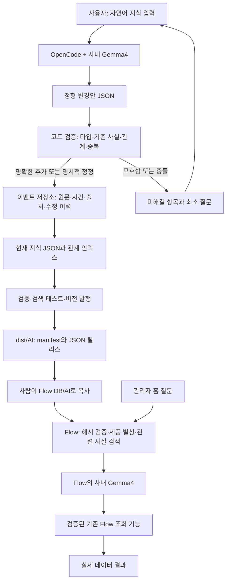

# SECOND BRAIN — OpenCode + 사내 Gemma4 구현·운영 계약

이 문서를 독립적인 사내 `second-brain/` 프로젝트의 OpenCode에 전달한다. 사용자는 자연어로 지식만 계속 입력하고, OpenCode가 구조화·관계 연결·이력 저장·검색 패키지 생성을 수행하게 만드는 것이 목표다. Flow는 완성된 패키지를 읽는 소비자다. Flow 안에 지식 편집기나 저작 기능을 만들지 않는다.

이 파일은 구현 계획과 실행 지침이다. 아래 `brain.py` 명령과 외부 프로젝트는 OpenCode가 구현할 대상이며, 이 문서만 복사한다고 해당 프로그램이 설치되는 것은 아니다. Flow 쪽 JSON 소비 계약은 이 변경에 구현되어 있다.

## 1. OpenCode에 가장 먼저 줄 요청

> SECOND_BRAIN.md 전체를 읽고 이 디렉터리에 독립 second-brain 프로젝트를 구현해줘. 루트 AGENTS.md에 이 문서를 매 세션 읽는 규칙을 넣어줘. 내가 자연어로 지식을 입력하면 원문과 출처를 보존하고 product, alias, measurement_binding, term, rule로 정형화해줘. 명확한 새 지식은 자동 반영하고 애매하거나 충돌한 내용만 질문해줘. 현재 사실과 변경 이력을 분리하고, 시간은 시스템 시계로 기록해줘. 이 문서의 CLI, 스키마, 테스트와 Flow export 계약을 구현하고 실제 임시 디렉터리에서 검증해줘. Flow 저장소나 운영 DB는 수정하지 말고 dist/AI만 생성해줘. 구현되지 않은 항목을 완료했다고 말하지 마.

완료 조건: 예시 지식 두 문장을 순서대로 또는 역순으로 입력해도 같은 연결이 생기고, 같은 입력의 재전송이 중복 엔티티를 만들지 않으며, 변경·철회·시간 조회·충돌 해결·반입·롤백 테스트가 통과해야 한다.

## 2. 전체 구조



두 Gemma4는 역할이 다르다. OpenCode의 Gemma4는 파일과 도구를 사용해 지식 프로젝트를 유지한다. Flow의 Gemma4는 배포된 지식으로 질문을 해석한다. 모델 가중치나 채팅 기억에 지식을 저장한다고 가정하지 않는다.

## 3. 저장 구조와 단일 진실 원천

```text
second-brain/
  SECOND_BRAIN.md
  AGENTS.md
  opencode.json                     # 비밀값 없는 연결 설정
  schemas/                          # 모든 구조의 JSON Schema
  src/                              # 검증·병합·검색·발행 코드
  brain.py                          # CLI 진입점
  store/brain.sqlite                # 트랜잭션 원장, 사내 로컬 전용
  sources/                          # 원문 자료 및 source ID
  knowledge/entities.json           # 원장에서 재생성하는 현재 투영
  knowledge/bindings.json
  knowledge/terms.json
  knowledge/rules.json
  knowledge/relations.json
  history/events.jsonl              # 원장에서 재생성하는 감사용 내보내기
  pending/conflicts.json             # 미해결 사항, 활성 패키지에서 제외
  tests/fixtures/                   # 합성 데이터만
  tests/golden/                     # 질문 → 기대 엔티티/관계
  dist/AI/manifest.json
  dist/AI/releases/<version>/*.json
  release-history/                  # 이전 manifest와 검증 보고서
```

권장 구현은 Python 표준 sqlite3를 사용한 로컬 트랜잭션 원장이다. JSON 여러 파일을 동시에 갱신하다 일부만 저장되는 문제를 피한다. SQLite가 정본이고 knowledge/history는 재생성 가능한 JSON 투영이다. 사용자는 SQLite나 JSON을 직접 편집할 필요가 없다. Graph DB·벡터 DB 없이 시작한다. 노드 ID와 관계 ID로 그래프를 표현하고 필요할 때만 검색 인덱스를 추가한다.

쓰기 트랜잭션은 input_id 중복 확인 → 원문 저장 → 검증된 이벤트 → 현재 사실 갱신까지 함께 커밋한다. JSON 투영은 임시 디렉터리에 완성한 뒤 교체한다. 실패 시 원장은 온전하고 투영은 다시 생성한다. 여러 OpenCode 세션의 변경은 revision 비교로 직렬화하며 충돌한 패치를 다시 검증한다.

## 4. 사용자 입력을 정형화하는 규칙

다음과 같은 문장을 계속 입력하는 것이 정상 사용법이다.

- “제품 X0는 보통 X 또는 Xzero라고 불러.”
- “게이트 CD는 제품 X에서 step SX100의 CD_A item이야.”
- “방금 말한 건 잘못됐고 SX110이 맞아. 오늘부터가 아니라 원래 그랬어.”
- “제품 Y의 게이트 CD는 다른 step이니까 X와 합치면 안 돼.”

제품 표기에는 숫자와 접미사를 보존한다. 예를 들어 합성 제품 `PRODUCT_A0`에
`PROD_A`, `PROD_0`을 별칭으로 등록할 수 있지만 `0`을 삭제하거나 비슷한 문자열을
자동 병합하지 않는다. “`<개념>`은 `<제품 별칭>`에서 step id `<STEP_ID>`의
`<ITEM>` item”처럼 입력하면 제품 별칭을 먼저 해석한 뒤 product 범위가 붙은
measurement_binding으로 저장한다. 실제 사내 제품명·step·item은 이 예시를 대체해
외부 second-brain에만 기록한다.

여기의 제품·step·item은 **합성 예시**다. 이 문서나 예시를 실지식으로 자동 등록하지 않는다. 실제 사내 명칭과 사용자가 입력하는 원문은 독립 프로젝트에만 보관하고 public Flow 저장소나 setup.py에 포함하지 않는다.

### 처리 순서

1. OpenCode가 자연어 원문을 intake 파일로 저장한다. 코드가 input_id, source_id, received_at, actor를 발급한다. 모델이 과거 시각을 만들어 기록하지 않는다.
2. Gemma4는 후보 엔티티·별칭·관계·적용 범위·시점·변경 의도를 JSON으로 추출한다. 모델 출력은 제안일 뿐이며 코드가 스키마를 검증한다.
3. 대소문자·Unicode NFKC·앞뒤 공백으로 검색용 키를 정규화하되 원래 표기는 보존한다. 숫자를 버리거나 비슷한 문자열만으로 제품을 합치지 않는다.
4. 기존 ID와 연결한다. 관계를 먼저 받았는데 제품 별칭이 아직 없으면 unresolved 참조로 보존한다. 나중에 별칭이 유일하게 해결되면 관계를 자동 연결하고 resolve 이벤트를 남긴다.
5. 출처가 명확한 사용자 직접 진술이고 충돌하지 않는 추가는 active로 자동 반영한다. 매번 사용자에게 승인 버튼을 요구하지 않는다.
6. “일 수도 있다” 같은 불확실한 문장과 자료로부터 모델이 추론한 것은 proposed로 남긴다. 한 별칭이 여러 제품에 걸리거나 기존 사실과 모순되면 conflict로 보류하고 필요한 질문만 한다.
7. 사용자가 명시적으로 정정하면 이전 revision을 superseded로 만들고 새 revision을 활성화한다. 단순히 새로 입력됐다는 이유만으로 기존 사실을 덮지 않는다.
8. 구조·관계 검증 후 현재 투영과 인덱스를 재생성한다. 정상 업데이트는 한두 문장으로 “추가/연결/중복 확인/보류”와 바뀐 항목을 보고한다.

### 중복과 시간

- 같은 input_id 재시도는 완전한 no-op이다. 문장 해시가 같아도 별도 시점의 새 입력은 confirmation 이벤트가 될 수 있다.
- 같은 사실 재확인은 사실 ID와 updated_at을 그대로 두고 last_confirmed_at·evidence만 갱신한다.
- created_at/updated_at/recorded_at은 시스템 UTC ISO8601 Z로 저장한다. UI에서 Asia/Seoul로 표시한다.
- valid_from/valid_to는 업무상 효력 기간이다. 모르면 null이다. 기록 시각을 효력 시작으로 대신 쓰지 않는다.
- “오늘부터”의 오늘은 입력자의 업무 시간대 Asia/Seoul 기준 날짜다. “원래 틀렸다”는 기록 정정이고 미래의 공정 변경과 구분한다.
- 원장은 삭제하지 않는다. retract/supersede/merge/resolve/confirm 이벤트로 바꾼다. 민감정보 삭제 요구는 별도의 관리 작업으로 처리한다.

## 5. 엔티티와 관계 모델

고유 ID는 생성 후 변경하지 않는다. 제품명 변경도 ID는 유지한다. 외부 명칭을 ID 문자열 자체로 사용하지 않고 UUID를 코드가 발급한다. 아래 짧은 ID는 설명용이다.

| 종류 | 핵심 필드 | 연결 |
|---|---|---|
| product | id, canonical_name, aliases | 별칭 → 제품 |
| measurement_binding | id, concept, product_id, step_id, item | 의미 → 특정 제품의 step/item |
| term | id, name, aliases, definition | 용어 ↔ 관련 개념 |
| rule | id, name, description, scope | 범위에 따른 해석 규칙 |
| source | id, original_text 또는 파일 참조, actor, received_at | 모든 사실의 근거 |
| event | id, input_id, type, target_id, before/after revision | 변경 이력 |

step은 제품 안에서 식별한다. 동일 step_id가 다른 제품에 있어도 동일 노드로 취급하지 않는다. 측정 의미(concept)와 실제 item 이름은 별개다. measurement_binding은 product + concept + step + item + 효력 기간의 관계이며, 한 개념이 복수 step에 매핑될 수 있다. 대표 하나를 자동 선택하지 말고 대상 조건을 남긴다.

제품별 매핑은 전역 동의어가 아니다. “게이트 CD = CD_A”만 저장하면 제품·step 맥락이 사라진다. 반드시 product_id와 step_id를 함께 보존한다. unit, grain, source_id, 실제 컬럼 등 사용자가 말하지 않은 속성은 null 또는 미확정이다.

원장 record 공통 필드: id, kind, status, revision, created_at, updated_at, last_confirmed_at, valid_from, valid_to, source_ids. 상태는 active/proposed/conflict/superseded/retracted. source_ids는 원장의 실제 source를 참조해야 한다. 변경 이벤트는 actor, input_id, recorded_at, reason, previous_revision, next_revision을 갖는다.

## 6. Flow가 읽는 JSON 계약 — schema_version 2

Flow에는 정리된 **현재 active 사실만** 내보낸다. 원문·SQLite·대화 전체·미해결 사실은 반입 대상이 아니다. 원장 전체를 덤프하지 않는다. 문서가 길면 정규화된 작은 record로 나눈다.

manifest.json:

```json
{
  "schema_version": 2,
  "release": {
    "version": "20260910-001",
    "approved": true,
    "documents": [
      {"path": "releases/20260910-001/products.json", "sha256": "<파일 바이트의 SHA256 소문자 64자리>"},
      {"path": "releases/20260910-001/bindings.json", "sha256": "<파일 바이트의 SHA256 소문자 64자리>"}
    ]
  }
}
```

각 JSON 파일의 최상위는 record 배열이다. 코드가 JSON으로 직렬화하며 LLM이 쉼표나 해시를 손으로 만들지 않는다. 다음은 합성 예시다.

```json
[
  {
    "id": "product-example-x0",
    "kind": "product",
    "canonical_name": "EXAMPLE_X0",
    "aliases": ["X", "Xzero"],
    "status": "active",
    "created_at": "2026-09-10T00:00:00Z",
    "updated_at": "2026-09-10T00:00:00Z",
    "source_ids": ["source-example-1"]
  },
  {
    "id": "binding-example-1",
    "kind": "measurement_binding",
    "concept": "게이트 CD",
    "product_id": "product-example-x0",
    "step_id": "SX100",
    "item": "CD_A",
    "unit": null,
    "grain": null,
    "status": "active",
    "created_at": "2026-09-10T00:01:00Z",
    "updated_at": "2026-09-10T00:01:00Z",
    "source_ids": ["source-example-2"]
  }
]
```

release와 manifest의 키는 위 계약과 정확히 일치해야 한다. 각 record는 id/kind/status/created_at/updated_at/source_ids가 필수다. product는 canonical_name, aliases 배열; measurement_binding은 concept/product_id/step_id/item이 필수다. term/rule의 본문은 definition/description, scope 등으로 담는다. 실행 코드·SQL·API 경로는 권한이 아니며 문서 입력으로 도구를 추가하지 않는다.

제한: 최대 32파일, 파일당 128KiB, 총 512KiB, 파일당 1,000record 이하, record 직렬화 길이 4,000자 이하, manifest 64KiB. version은 영문·숫자로 시작하는 1~64자 영문/숫자/점/밑줄/하이픈. 경로는 releases/<같은 version>/*.json. UTF-8. 절대경로·상위경로·심볼릭 링크 금지. ID 중복·파일 해시 오류는 전체 릴리스를 거부한다. 레코드 관계의 누락도 발행 전 거부한다.

JSON record의 source_ids는 외부 원장 추적용 ID다. 실제 source 원문은 Flow에 복사하지 않는다. 출처 표시용 비민감 제목을 source_labels 같은 선택 필드로 담을 수 있지만 사실 내용과 별도로 검증한다.

기존 schema_version 1 MD 패키지는 하위 호환으로 읽지만, 신규 외부 2nd Brain은 version 2 JSON을 생성한다. 이전 drafts/publish.py 기반 MD 저작 패키지를 이번 프로젝트의 원장으로 사용하지 않는다.

## 7. OpenCode가 구현할 CLI

다음 명령 이름은 프로젝트의 인터페이스 요구사항이다. 구현 전에는 실행 가능한 명령으로 안내하지 않는다.

```text
python brain.py ingest --file intake.txt --actor operator --input-id <UUID>
python brain.py resolve --conflict-id <ID> --file resolution.txt
python brain.py query --text "Xzero의 게이트 CD는 어느 step/item인가?"
python brain.py history --id <fact-ID>
python brain.py validate
python brain.py test
python brain.py export --version 20260910-001 --out dist/AI
python brain.py rollback --version <previous> --out dist/AI
```

사용자는 위 명령을 외울 필요가 없다. OpenCode가 자연어 요청을 받고 파일 생성 및 CLI 호출을 한다. ingest는 모델 제안 추출과 코드 기반 검증/반영을 구분한다. 모델 출력 검증 실패는 원문을 보존한 채 오류를 보고하며 잘린 JSON을 임의 수선하여 사실로 저장하지 않는다.

export는 active 현재 사실 선택 → source/FK/타입/동의어 충돌 검증 → golden test → staging에 파일 작성 → SHA256 생성 → release 경로 확정 → manifest 원자적 교체 순서다. approved:true는 검증을 통과한 게시 스냅샷이라는 뜻이다. 충돌 없는 직접 입력까지 매번 사람이 따로 승인할 필요는 없다. proposed/conflict는 제외된 수와 이유를 보고한다. 같은 version으로 다른 내용을 재발행하지 않는다.

새 릴리스 디렉터리를 먼저 복사하고 manifest는 마지막에 교체한다. Flow가 질문 처리 중 반쯤 복사된 파일을 보지 않게 한다. manifest를 덮기 전 새 이름으로 쓴 뒤 같은 파일시스템에서 os.replace를 쓴다. 이전 버전을 남겨 롤백은 이전 manifest를 다시 활성화하는 것으로 처리한다.

## 8. OpenCode 세션 운영 지침

프로젝트 AGENTS.md에 다음을 작성한다.

```text
먼저 SECOND_BRAIN.md를 읽고 계약을 따른다.
사용자의 지식 입력을 설명만 하고 끝내지 말고 ingest를 통해 저장한다.
식별자·시각·해시·revision은 코드가 생성한다.
사용자 원문과 출처를 보존하고 제품별 범위를 지킨다.
명확한 새 사실은 자동 반영하고 충돌·불확실성만 질문한다.
기존 사실이 있으면 덮어쓰기 대신 정정 또는 확인 이벤트를 만든다.
JSON을 직접 수정하지 말고 트랜잭션 CLI로 변경한다.
임의 파일에 비밀키를 쓰지 말고 Flow 운영 DB에는 쓰지 않는다.
원문·지식·대화·DB를 외부 API나 공개 원격으로 전송하지 않는다.
작업 후 반영된 fact ID, 연결된 product/step/item, 확인 시각, 보류 사항을 짧게 보고한다.
```

일상 사용 예:

> “이 지식 추가해줘: 제품 X0는 X 또는 Xzero라고 불러.”
> “게이트 CD는 X에서 SX100 step의 CD_A item이야.”
> “방금 추가한 내용과 연결된 지식 보여줘.”
> “SX100은 잘못 입력했고 SX110이 맞아. 기존 근거를 남기고 정정해줘.”
> “검증하고 Flow 반입용 패키지 만들어줘.”

첫 문장만으로 제품 엔티티와 두 별칭이 생긴다. 둘째 문장의 X가 같은 제품 ID로 해석되어 binding을 만든다. 같은 문장을 재입력하면 binding이 늘지 않는다. 새로운 다른 step을 명시적 정정 없이 입력하면 “기존 매핑 대체인지, 복수 step인지”를 질문한다.

## 9. 사내 Gemma4와 OpenCode 연결

설치된 OpenCode 버전을 먼저 기록하고 그 버전의 설정 스키마를 확인한다. OpenCode는 사용자 정의 provider와 프로젝트 AGENTS.md를 지원한다. 모델 선택은 provider/model ID 단위다. 사내망에서 필요한 패키지는 설치 시 사전 반입하고 지식 입력 중 외부 fallback을 쓰지 않는다.

사내 게이트웨이가 일반 OpenAI 호환 Chat Completions만 받으면 custom provider의 baseURL과 model ID를 연결한다. 다음은 공식 provider 문서 계열의 설정 예시이며 설치 버전에서 필드 지원을 확인해야 한다.

```json
{
  "$schema": "https://opencode.ai/config.json",
  "model": "internal/Gemma4-260430",
  "provider": {
    "internal": {
      "npm": "@ai-sdk/openai-compatible",
      "name": "Internal Gemma4",
      "options": {"baseURL": "http://127.0.0.1:8765/v1"},
      "models": {"Gemma4-260430": {"name": "Internal Gemma4"}}
    }
  }
}
```

위 localhost 주소는 **구현할 로컬 호환 프록시 예시**이며 제공된 서버가 아니다. 사내 게이트웨이에 바로 연결해도 되는 경우 실제 baseURL로 바꾼다. 현재 Flow gemma4 프로필은 x-dep-ticket, Send-System-Name, User-Id, User-Type, 요청별 Prompt-Msg-Id/Completion-Msg-Id와 stream:false를 사용한다. OpenCode가 요구하는 streaming/tool-call 계약과 같다고 가정하지 않는다.

연결 구현자는 먼저 다음을 검사한다: 일반 텍스트 응답 → system 메시지 → tool call JSON → 도구 결과를 넣은 후속 호출 → 스트리밍 지원 여부. 직접 연결이 이 계약을 만족하지 않으면 로컬 사내 프록시를 구현한다. 프록시는 credential을 환경변수에서 읽고 요청마다 새 메시지 ID를 생성하며, 지원하는 요청·응답 변환만 수행한다. 도구 호출을 지원하지 않는 모델의 텍스트를 임의로 tool call로 위조하지 않는다. 모델의 도구 사용이 불가하면 완전 자동 OpenCode 운영은 미완료로 보고하고 호환 provider/모델 설정을 해결해야 한다.

실제 사내 주소와 인증값은 이 문서와 public 저장소에 기록하지 않는다. 연결 정보 입력은 사내 프로젝트에서 한다. OpenCode /models에서 선택한 모델과 실제 네트워크 대상이 일치하는지 확인한다.

공식 참고(확인일 2026-09-10):
- https://opencode.ai/docs/providers/ — custom provider, baseURL, 모델 선택
- https://opencode.ai/docs/rules/ — AGENTS.md 프로젝트 규칙

## 10. Flow 사용 범위와 연결 검사

1. 업데이트된 setup.py 설치 후 앱을 재시작한다.
2. 관리자 설정에서 Gemma4 프로필의 URL·credential·Send-System-Name을 저장한다. 사내 모델 ID는 현재 Gemma4-260430 계약이다.
3. 홈 `연결 검사`가 실제 모델 응답을 확인한다. 최근 120초 응답 성공은 초록, 실패 빨강, 미확인 노랑, 비활성 회색이다. GET 상태 조회는 모델 호출을 소비하지 않는다.
4. dist/AI의 릴리스를 실제 FLOW_DB_ROOT/AI에 복사하고 manifest를 마지막에 활성화한다. flow-data/AI가 아니다.
5. 홈에서 시맨틱 상태 ready와 버전을 확인한다. 다음 질문부터 새 파일을 읽으므로 지식 변경만으로 재시작하지 않는다.

현재 Flow 연결은 (a) 실제 등록 제품명과 일치하는 JSON product 별칭 해석, (b) 홈의 기존 기능 선택 LLM에 관련 record 제공이다. 제품 별칭은 정확 이름 일치 다음, 기존 약칭 휴리스틱 전에 사용한다. 여러 제품에 같은 별칭이 걸리면 후보를 모두 반환하여 명확화한다. 실제 Flow 제품 목록에 없는 canonical_name은 실행용 제품으로 사용하지 않는다.

관련 지식은 최대 8개 record, 합계 12,000자로 제한한다. 제품 별칭을 제품 ID로 확장해 binding 검색에 활용하며 JSON은 중간에서 자르지 않는다. 이것은 경량 어휘 검색이다. 대규모 multi-hop graph RAG나 임베딩 검색 엔진은 아직 구현되어 있지 않다.

MD/JSON에 측정 binding을 넣는 것과 실제 측정값을 조회하는 기능은 별개다. 현재 허용 도구가 step/item 조건 조회를 지원하지 않는 경우 해당 지식만으로 측정 데이터를 실행 조회할 수 없다. OpenCode는 Flow 기능 목록과 계약을 확인하여 부족한 실행 도구를 후속 작업으로 명시한다. Split/TEG 전용 처리와 다른 SQL/차트 편집기의 모든 프롬프트에 자동 적용되는 구조도 아니다. 실행되지 않은 기능을 “조회 완료”로 말하지 않는다.

다중 웹 프로세스의 연결 신호등은 프로세스별 최근 호출 상태이므로 일부는 미확인일 수 있다. 실제 사내 접속 성공은 사내 서버에서 검사해야 한다.

## 11. 구현 단계와 합격 기준

1단계: SQLite 원장·JSON Schema·ID/시각 발급·ingest/confirm/supersede/retract/resolve. 원문 저장과 현재 상태가 한 트랜잭션인지 테스트한다.
2단계: 제품 별칭과 binding·관계 검증·역순 입력 해결·충돌 큐·정정/재확인. 모호하지 않은 입력은 질문 없이 저장한다.
3단계: OpenCode 규칙·사내 provider 호환성·자연어 입력부터 CLI 저장까지 연동. 빈 디렉터리에서 실제 세션 시나리오를 재현한다.
4단계: export·manifest/hash·복사 순서·Flow 로더 계약 검사·롤백. Flow 전체 원격 공개 없이 합성 패키지로 검증한다.
5단계: 지식량 증가 시 단어 인덱스·관계 확장·시점 검색을 측정해 추가한다. 검색 누락률과 잘못된 제품 결합률을 먼저 측정하고 임베딩은 필요할 때 도입한다.

필수 회귀 시나리오:
- 별칭 먼저/측정 매핑 먼저 입력해도 같은 엔티티로 연결.
- 같은 input_id 재전송 시 이벤트 중복 없음.
- 같은 사실 반복은 last_confirmed_at만 변경, 사실 revision 유지.
- 다른 제품의 동일 step/item은 독립 관계.
- 별칭 충돌 시 자동 병합 금지.
- 모르는 단위/컬럼/효력 날짜는 생성 금지.
- 정정 전후 시점 조회와 기록 시점 조회를 구분.
- 정정/철회 이후 이전 active가 export에 남지 않음.
- DB 파일명을 바꿔도 내부 product ID 유지, 실제 canonical_name 매핑 검증.
- 저장 도중 종료·동시 수정에도 원장 일관성 유지.
- 해시 손상/경로 이탈/중복 ID/누락 product 참조 시 발행 실패.
- 반입 후 별칭으로 제품을 찾고 관련 binding을 검색.
- 미지원 조회는 미지원이라고 보고, 수치/데이터 생성 금지.

## 12. 배포 경계

SECOND_BRAIN.md는 일반적인 설계·작동 지침으로 setup.py에 포함한다. 실제 사내 사용자 입력·학습 원문·제품 관계 JSON·인증정보는 외부 second-brain에만 보관하고 설치 번들에 포함하지 않는다. dist/AI는 사내에서 별도로 Flow DB/AI에 반입한다. 코드 배포와 지식 배포의 수명주기를 분리한다.
