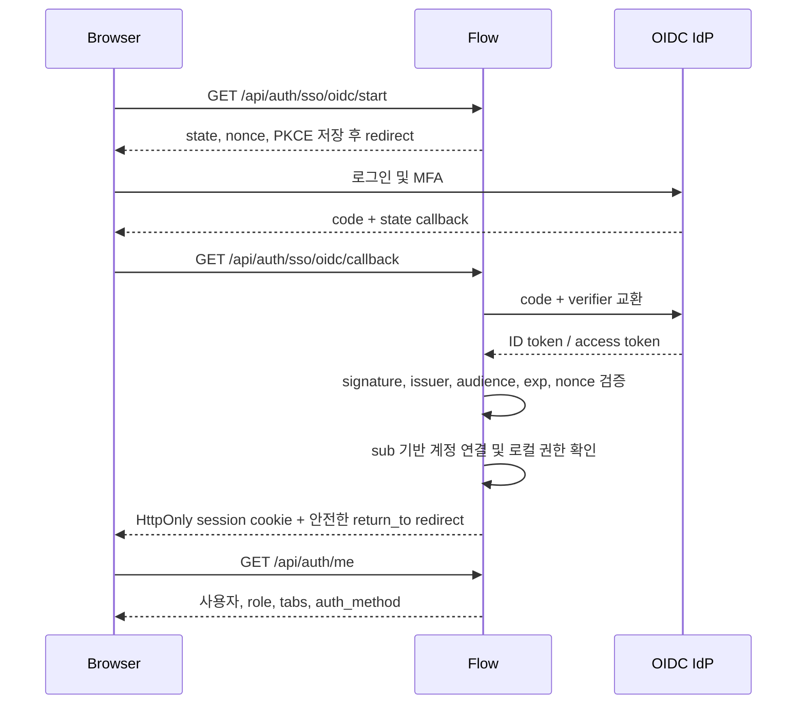

# Flow 디자인 통일·기능 개선·SSO 도입 실행 계획

> 작성 기준: 2026-08-13  
> 대상 저장소: `goood2280/flow`  
> 기준 소스: `main` 및 소스 공개 초안 PR #14 (`agent/publish-flow-source-v10-4-106`, Flow 10.4.106)

## 1. 문서 목적

이 문서는 다음 세 작업을 서로 충돌하지 않도록 한 로드맵으로 묶는다.

1. 탭마다 달라진 디자인을 하나의 운영형 UI 시스템으로 통일한다.
2. 각 기능의 성능·사용성·유지보수성·안정성을 개선한다.
3. 기존 ID/PW 로그인을 유지하면서 OIDC 기반 사내 SSO를 안전하게 추가한다.

이 문서는 구현 순서와 변경 파일을 정하는 상위 계획이다. 실제 구현 PR은 아래의 작은 단위로 나누며, 각 PR은 독립적으로 배포·롤백할 수 있어야 한다.

---

## 2. 현재 상태와 핵심 판단

### 2.1 확인된 구조적 문제

- `main`은 실제 소스 대신 거대한 `setup.py` 번들을 중심으로 관리되어 작은 변경도 리뷰하기 어렵다.
- 최신 소스 기준 백엔드 라우터 3개가 약 6만 줄에 이르고, 프런트 페이지 10개 이상이 2천 줄을 넘는다.
- 29개 페이지 중 `PageShell` 사용은 4개, `PageHeader` 사용은 9개다.
- 프런트에 인라인 스타일 약 6천 개, 직접 작성한 hex 색상 약 1천 개, 원시 버튼·입력·테이블이 다수 존재한다.
- `global.css`, `carbon.css`, `useFlowShell.js`, `UXKit.jsx`가 각각 디자인 값을 소유한다.
- `carbon.css`가 인라인 스타일 속성 선택자와 `!important`로 페이지를 사후 보정한다.
- API/worker가 공유하는 JSON 파일에 프로세스 내부 잠금만 적용되어 다중 프로세스 충돌 위험이 있다.
- 페이지 정의가 `config.js`, `pageRegistry.jsx`, `App.jsx`, 백엔드 권한 표에 중복된다.
- GitHub Actions와 재현 가능한 Python 의존성 잠금 파일이 없다.
- 현재 세션 토큰은 `localStorage` 및 `X-Session-Token`에 의존한다. SSO를 붙이기 전에 세션 경계를 보강해야 한다.

### 2.2 유지할 강점

- 페이지 단위 lazy loading은 유지한다.
- Parquet projection, bounded scan, 캐시 예열, 메모리 guard, worker 분리, 취소 처리 구조는 유지한다.
- `backend/core/auth_providers.py`에 이미 비밀번호 인증과 세션 발급을 분리한 Provider 추상화가 있으므로 SSO 기반으로 재사용한다.
- 신규 `My_YieldMap.jsx`처럼 UXKit 기반으로 비교적 작게 작성된 페이지를 신규 화면의 참고 구현으로 삼는다.
- 권한은 IdP 그룹이 아니라 Flow의 로컬 role/tab 정책이 최종 결정하도록 유지한다.

### 2.3 목표 디자인 방향

Flow는 콘텐츠 감상형 서비스가 아니라 데이터 탐색·운영·분석 도구다. 따라서 현재 `carbon.css`가 지향하는 **밀도 높은 플랫 운영 UI**를 기준으로 삼는다.

- 작은 radius와 얕은 elevation
- 정렬된 헤더·툴바·필터·테이블
- 상태색은 의미가 있을 때만 사용
- 데이터 밀도는 높이되 클릭 영역과 접근성은 보장
- 장식은 로그인/브랜드 화면에 한정하고 업무 탭은 일관성과 속도를 우선

---

## 3. 전체 성공 지표

| 영역 | 완료 기준 |
|---|---|
| 소스 관리 | 실제 소스가 기준이며 `setup.py`는 CI가 생성하는 배포 산출물이다. |
| 디자인 | 사용자 탭 100%가 공통 Shell/Header/상태 컴포넌트를 사용한다. |
| 스타일 | 신규 raw hex·인라인 색상·radius·spacing이 lint에서 차단된다. 기존 인라인 스타일은 80% 이상 줄인다. |
| UI 품질 | 주요 탭 light/dark, 1280/1440/1920 해상도의 스크린샷 회귀 테스트를 통과한다. |
| API | 인증·오류·취소·재시도 규칙이 단일 API client로 통일된다. |
| 폴링 | 동일 endpoint의 요청 중첩이 없고, hidden tab에서 불필요한 폴링이 중지된다. |
| 백엔드 | 신규 라우터는 HTTP/검증/권한만 담당하며 도메인 로직과 저장소가 분리된다. |
| 저장소 | 사용자·세션·설정·요청 상태는 다중 프로세스 안전 저장소를 사용한다. |
| CI | backend unit, frontend build/lint, API smoke, 보안·번들 검증이 PR 필수 check로 실행된다. |
| SSO | OIDC Authorization Code Flow, state/nonce/PKCE, 보안 쿠키, 감사 로그, 롤백 절차를 갖춘다. |

---

## 4. 실행 단계 요약

| 단계 | 예상 기간 | 결과 |
|---|---:|---|
| Phase 0. 기반 안정화 | 2~4일 | 소스 기준화, CI, 공개 범위 확인, 배포 진단 오류 수정 |
| Phase 1. 디자인 기반 | 1~2주 | 토큰·공통 컴포넌트·페이지 manifest·회귀 테스트 |
| Phase 2. 기능별 이전 | 3~6주 | 모든 탭을 공통 템플릿으로 이전하고 기능 병목 개선 |
| Phase 3. 인증 기반 보강 | 1주 | 쿠키 세션, CSRF, 세션 저장소, 로그인 보안 강화 |
| Phase 4. OIDC SSO | 1~2주 | 사내 SSO, 계정 연결·프로비저닝·그룹 매핑·점진 배포 |
| Phase 5. 백엔드/배포 구조화 | 병행 4~8주 | 대형 라우터 분리, SQLite/DB 이전, 원자적 배포 |

기간은 개발자 1명 기준의 대략적인 순수 구현 시간이며 IdP 관리자 승인·보안 검토 기간은 별도다.

---

# Part A. 디자인 통일화 상세 계획

## 5. 디자인 토큰 단일화

### 5.1 신규 파일

| 파일 | 역할 |
|---|---|
| `frontend/src/styles/tokens.css` | 색상, typography, spacing, radius, shadow, control height, z-index의 유일한 원본 |
| `frontend/src/styles/components.css` | Button/Input/Table/Card/Modal/Toolbar 등의 공통 class |
| `frontend/src/styles/layouts.css` | AppShell/PageShell/Explorer/Analysis/Workboard/Admin 템플릿 |
| `frontend/src/styles/utilities.css` | 제한된 layout utility. 색상 utility는 만들지 않는다. |
| `frontend/src/components/ui/index.js` | 공통 UI export 진입점 |
| `frontend/src/components/ui/Feedback.jsx` | Loading/Empty/Error/Permission/Offline 상태 |
| `frontend/src/components/ui/FormField.jsx` | label, help, error, required, 접근성 연결 |
| `frontend/src/components/ui/DataTable.jsx` | 헤더, 정렬, sticky, empty, loading, pagination 규약 |
| `frontend/src/components/ui/ConfirmDialog.jsx` | 삭제·위험 작업 확인 규약 |

### 5.2 수정 파일

| 파일 | 변경 내용 |
|---|---|
| `frontend/src/global.css` | reset·기본 typography·전역 focus만 남기고 페이지별 규칙 제거 |
| `frontend/src/styles/carbon.css` | 디자인 방향은 유지하되 속성 선택자와 광범위한 `!important`를 단계적으로 제거 |
| `frontend/src/app/useFlowShell.js` | JS 색상 팔레트를 제거하고 theme 이름/상태만 관리 |
| `frontend/src/components/UXKit.jsx` | 토큰 값을 직접 가지지 않고 공통 class를 사용하는 얇은 컴포넌트로 분리 |
| `frontend/src/App.jsx` | 탭별 overflow 예외를 제거하고 공통 Shell이 레이아웃을 결정하도록 변경 |

### 5.3 토큰 규칙

- 색상은 `--color-*`, 의미색은 `--status-*`, 배경은 `--surface-*`로 구분한다.
- spacing은 4px 기반 `--space-1`~`--space-8`로 제한한다.
- control 높이는 compact/default 두 밀도만 지원한다.
- radius는 2/4/8px 세 단계만 허용한다.
- font size는 caption/body/label/title/page-title의 다섯 단계로 제한한다.
- 차트 팔레트는 UI 색상과 분리하며 색약 안전 팔레트를 유지한다.
- 컴포넌트 밖에서 `#rrggbb`, `rgb()`, 임의 box-shadow를 새로 작성하지 않는다.

### 5.4 완료 조건

- light/dark theme가 동일한 토큰 이름을 사용한다.
- `PageShell`의 높이는 실제 navigation 높이 토큰으로 계산한다. 현재 52px/48px 불일치를 제거한다.
- `carbon.css`의 `[style*=...]` 보정 규칙을 모두 삭제할 수 있다.
- DevGuide 또는 Storybook에서 토큰과 모든 상태를 한 화면에서 확인할 수 있다.

## 6. 페이지 골격과 공통 컴포넌트

모든 업무 탭은 다음 계층을 사용한다.

```text
AppShell
└─ PageShell
   ├─ PageHeader: 제목, 설명, 상태, 대표 action
   ├─ SectionTabs: 하위 기능 전환
   ├─ Toolbar / FilterBar: 조회 조건과 보조 action
   └─ PageContent
      ├─ Loading / Empty / Error
      └─ 실제 콘텐츠
```

### 6.1 화면 템플릿

| 템플릿 | 대상 | 표준 동작 |
|---|---|---|
| Explorer | FileBrowser, SplitTable, RAM Cache | 좌측 탐색/필터, 우측 상세, split resize, URL 상태 보존 |
| Analysis | Dashboard, ChartBuilder, TEG, Yield Map | 조건→실행→결과, 차트/표 전환, 결과 export |
| Workboard | Inform, Tracker, Meeting, Lot Request, Calendar | 상태 필터, 목록/상세, audit timeline, optimistic update |
| Workflow | Reformatize, DCOP, Auto Report, Match Fill | 단계 표시, 입력 검증, 실행 상태, 결과/재실행 |
| Admin | Admin, Cache, DevGuide | 좌측 카테고리, 위험 action 격리, 변경 전후/감사 기록 |

### 6.2 컴포넌트 사용 규칙

- action은 `Button`의 primary/secondary/ghost/danger 네 종류만 사용한다.
- Form 입력은 항상 `FormField` 안에 배치하고 label 없는 입력은 `aria-label`을 요구한다.
- 데이터 조회 화면은 Loading/Empty/Error를 명확히 분리한다.
- 삭제·초기화·강제 실행은 `ConfirmDialog`와 audit reason을 사용한다.
- 테이블은 숫자 우측 정렬, 단위 표기, sticky header, empty 상태를 공통 적용한다.
- 상태 표현은 색상만 사용하지 않고 icon/text를 함께 제공한다.
- 페이지에 직접 modal 구현을 금지하고 공통 Modal/Drawer를 사용한다.

## 7. 단일 페이지 manifest

### 7.1 신규 파일

- `frontend/src/app/pageManifest.js`
- `backend/core/page_manifest.json` 또는 빌드 시 생성되는 공유 JSON
- `tests/test_page_manifest_contract.py`

### 7.2 manifest 필드

```js
{
  key,
  label,
  icon,
  group,
  component,
  adminOnly,
  defaultEnabled,
  subtabs,
  layout,
  helpId
}
```

### 7.3 대체 대상

- `frontend/src/config.js`의 `TABS`, `SUB_TABS`
- `frontend/src/app/pageRegistry.jsx`의 `PAGE_MAP`
- `frontend/src/App.jsx`의 `NAV_GROUPS`
- `backend/core/auth.py`의 페이지/하위 탭 권한 상수

프런트 lazy import는 JS manifest가 담당하고, backend 권한 검증에는 build script가 생성한 순수 JSON을 사용한다. 계약 테스트는 key, subtab, admin flag 불일치를 즉시 실패시킨다.

## 8. 디자인 이전 순서

### Wave 1: 공통 기반 검증

- `My_YieldMap.jsx`를 기준 페이지로 정리
- `My_DevGuide.jsx`에 토큰·컴포넌트 카탈로그 추가
- 로그인 화면의 form/control을 토큰화하되 브랜드 animation은 유지

### Wave 2: UXKit 미사용/낮은 사용 페이지

- `My_ChartBuilder.jsx`
- `My_TemplateReport.jsx`
- `My_LotManagement.jsx`
- `My_RamCache.jsx`

### Wave 3: 자체 레이아웃이 강한 운영 화면

- `My_FileBrowser.jsx`
- `My_SplitTable.jsx`
- `My_Dashboard.jsx`
- `My_Diagnosis.jsx`

### Wave 4: 가장 큰 상태 중심 페이지

- `My_Inform.jsx`
- `My_Admin.jsx`
- 나머지 Workboard/Workflow 페이지

각 Wave는 화면 전체 rewrite가 아니라 Header→Toolbar→Feedback→Form→Table 순서로 교체한다. 기능 변경과 디자인 변경은 가능하면 PR을 분리한다.

## 9. 디자인 품질 자동화

### 신규 설정/테스트

- ESLint와 Stylelint 도입
- 신규 raw color, `!important`, 원시 form control, 임의 z-index를 차단하는 규칙
- Playwright component/E2E screenshot 테스트
- `/devguide?section=ui`에 공통 컴포넌트 상태 catalog

### 대표 스크린샷 조합

- light/dark
- 1280×720, 1440×900, 1920×1080
- loading, empty, error, populated, permission denied
- 긴 한글/영문, 200% zoom, keyboard focus

---

# Part B. 기능별 개선 계획

## 10. 공통 기능 개선

### 10.1 API client 통합

대상 파일:

- `frontend/src/lib/api.js`
- `frontend/src/main.jsx`
- 각 페이지의 로컬 `fetch` wrapper

계획:

1. `api.get/post/put/delete`로 응답 parsing과 오류 스키마를 통일한다.
2. 전역 `window.fetch` monkey patch를 제거한다.
3. AbortController, timeout, request ID, 401 처리, 429 backoff를 공통화한다.
4. 사용자 메시지와 진단용 오류를 분리한다.
5. 같은 GET의 짧은 시간 중복 호출을 dedupe한다.

완료 조건: 페이지에서 인증 header나 JSON 오류 parsing을 직접 작성하지 않는다.

### 10.2 폴링/캐시 통합

대상 파일:

- `frontend/src/hooks/usePolling.js`
- `frontend/src/App.jsx`
- `frontend/src/App.jsx` 내부의 `ContactButton`, `NoticeBanner`, 알림 polling
- 수동 `setInterval`을 사용하는 페이지

계획:

- 이전 요청이 진행 중이면 다음 tick을 건너뛴다.
- `setInterval` 대신 완료 후 `setTimeout` 또는 query scheduler를 사용한다.
- document hidden/offline에서 중지하고 복귀 시 즉시 1회 갱신한다.
- exponential backoff+jitter와 최대 실패 횟수를 적용한다.
- endpoint별 stale time과 refresh 정책을 registry로 관리한다.
- 장기적으로 React Query/SWR 도입 여부를 별도 ADR로 결정한다.

### 10.3 상태 저장과 동시성

대상 파일:

- `backend/app_v2/shared/json_store.py`
- `backend/core/auth.py`
- `backend/core/utils.py`
- `backend/core/shared_lease.py`
- JSON read-modify-write를 직접 수행하는 모듈

계획:

1. 단기: 고유 temp 파일, fsync+replace, 프로세스 간 파일 lock, corruption 경보를 적용한다.
2. 중기: 사용자, 외부 identity, session, request, meeting, inform, 설정, audit를 SQLite WAL로 옮긴다.
3. 분석 데이터와 재생성 가능한 cache는 Parquet를 유지한다.
4. lease에는 fencing token을 추가해 과거 owner의 write를 거부한다.

### 10.4 배포와 진단

- 공개 `/deploy-health.json`: 버전, index 존재 여부, 누락 asset 이름만 제공
- 관리자 `/deploy-info.json`: 경로, router, scheduler, repair 상세 제공
- 실행 중 `setup.py`를 `exec`해 소스/dist를 복구하는 동작 제거
- CI가 source→bundle을 생성하고 source/bundle fingerprint를 검증
- 버전별 immutable release 디렉터리 또는 container image를 원자적으로 교체

## 11. 탭별 개선 백로그

| 기능/탭 | 주요 개선 | 관련 파일 | 완료 지표 |
|---|---|---|---|
| 홈 | 핵심 상태·최근 작업·실패 작업을 사용자별로 우선 정렬. widget별 독립 오류·새로고침 제공 | `My_Home.jsx`, `routers/home.py`, `core/home_orchestrator.py` | 첫 유효 콘텐츠 시간 감소, widget 하나의 실패가 전체를 막지 않음 |
| 파일탐색기 | 쿼리 취소·가상 스크롤·서버 pagination·URL 기반 선택 상태. 대형 `filebrowser.py`를 browse/query/cache/export 서비스로 분리 | `My_FileBrowser.jsx`, `routers/filebrowser.py`, `core/filebrowser_*` | 동일 조회 중복 0, 큰 디렉터리 메모리 상한, 라우터 2천 줄 이하 단위로 축소 |
| 대시보드 | widget lazy load, 공통 filter context, 부분 실패 격리, query 결과 캐시 키 표준화 | `My_Dashboard.jsx`, `routers/dashboard.py`, `core/dashboard_join.py` | 느린 widget이 전체 render를 차단하지 않음 |
| 스플릿 테이블 | View/History URL 동기화, server-side filter/pagination, cache builder와 rulebook 책임 분리 | `My_SplitTable.jsx`, `routers/splittable.py`, `app_v2/modules/splittable/*` | 90개 route를 도메인별 router로 분리, 재조회량 감소 |
| 랏 관리 | 편집 전후 diff, bulk action preview, 낙관적 잠금, 실패 행 재시도 | `My_LotManagement.jsx`, `routers/lot_management.py`, `routers/lot_progress.py` | bulk 실패가 행 단위로 식별되고 중복 반영되지 않음 |
| 캐시 관리 | hit/miss/size/age/source를 한 모델로 표시. 위험한 clear/rebuild에 범위·예상 비용·확인 절차 제공 | `My_RamCache.jsx`, `core/cache_*`, `routers/admin.py` | 캐시별 owner와 만료 정책이 화면에서 확인 가능 |
| 매칭 채우기 | dry-run, 변경 preview, 중단/재개, 실패 원인별 재시도 | `My_MatchFill.jsx`, `routers/matching_fill.py`, `core/matching_fill.py` | 실행 전 변경량 확인, 작업 idempotency 보장 |
| 에이전트 | catalog/runtime/workflow UI 분리, 실행 trace와 tool input/output 요약, 취소·재실행 | `My_Diagnosis.jsx`, `routers/agent.py`, `routers/llm.py`, `core/agent_*` | 실행 상태가 단일 timeline으로 추적되고 실패 지점 재현 가능 |
| 차트 생성 | 차트 설정 schema화, query와 presentation 분리, 큰 Plotly chunk는 결과 영역에서만 import | `My_ChartBuilder.jsx`, `core/chart_builder_definition.py`, `routers/dashboard.py` | 유효하지 않은 설정 저장 방지, 초기 bundle 증가 없음 |
| Template Report | template version, preview snapshot, 변수 validation, publish/rollback | `My_TemplateReport.jsx`, `routers/template_report.py`, `core/report_variables.py` | 템플릿 변경 이력·롤백 가능 |
| Auto Report | 실행 queue, 진행률, cancel, retry, 결과 보존 기간 표시 | `My_AutoReport.jsx`, `routers/auto_report.py`, `core/auto_report*.py` | 중복 실행 방지, child process 종료 상태 추적 |
| 랏 배정/요청 | 상태 머신을 서버 단일 원본으로 정의하고 승인·반려·취소 audit 제공 | `My_LotRequest.jsx`, `routers/lot_requests.py` | 허용되지 않은 상태 전이 API에서 거부 |
| 매칭알람 | rule별 mute/snooze, 중복 알람 묶기, 확인/해제 SLA | `My_ValveAlerts.jsx`, `routers/valve_alerts.py`, `core/valve_*` | 동일 원인 알람 폭주 방지, 처리 이력 보존 |
| TEG 위치 조회 | 검색 조건 preset, 결과 근거/좌표 source 표시, map/table selection 동기화 | `My_TegMap.jsx`, `routers/teg_map.py`, `core/teg_*` | 좌표 출처와 변환 규칙을 결과에서 확인 가능 |
| Yield Map | 현재 UXKit 기반 구현을 기준 페이지로 사용. 대규모 wafer rendering worker/canvas 검토, legend 표준화 | `My_YieldMap.jsx`, `routers/yield_map.py`, `core/yield_map.py` | 대형 map에서 UI thread block 상한 설정 |
| ET 측정시간 | 조회 조건 URL 보존, unit/시간대 명시, background cache freshness 표시 | `My_EtTime.jsx`, `routers/et_time.py`, `core/et_tracker.py` | 사용자가 데이터 기준 시각을 확인 가능 |
| 인폼 로그 | 5천 줄 페이지를 list/detail/editor/matrix/audit로 분리. autosave, conflict detection, upload 상태 통합 | `My_Inform.jsx`, `routers/informs*.py`, `app_v2/modules/informs/*` | 동시 편집 덮어쓰기 방지, 하위 화면 독립 테스트 |
| ET 다운로드 | workflow 단계와 validation 결과를 명시하고 대용량 작업은 queue/streaming으로 이동 | `My_Reformatize.jsx`, `routers/reformatize.py`, `core/reformatize_child.py` | 요청 timeout 대신 job ID로 추적 |
| 양산 DCOP 검사 | rule version·검사 근거·예외 승인·결과 export 표준화 | `My_DcopCheck.jsx`, `core/dc_layer_mapping.py` | 결과가 사용한 rule version과 함께 재현 가능 |
| ET 추적 | 상태 전이·scheduler health·history cache freshness를 한 화면에 표시 | `My_Tracker.jsx`, `routers/tracker.py`, `app_v2/modules/tracker/*` | 누락/지연 원인이 scheduler, source, cache 중 어디인지 구분 가능 |
| 회의관리 | agenda→action item→담당자→기한 연결, 중복 저장 방지, audit | `My_Meeting.jsx`, `routers/meetings.py`, `app_v2/modules/meetings/*` | action item의 owner/due/status 누락 방지 |
| 변경점 관리 | calendar/list 공통 query, timezone 명시, 겹치는 변경 충돌 표시 | `My_Calendar.jsx`, `routers/calendar.py` | 시간대에 따른 날짜 이동 오류 테스트 통과 |
| 관리자 | 3천 줄 화면을 Users/Permissions/System/Cache/Diagnostics로 lazy 분리. 위험 작업에 reason·재인증 요구 | `My_Admin.jsx`, `routers/admin.py`, `routers/groups.py` | 하위 탭 독립 bundle, 모든 위험 작업 audit |
| 개발자 가이드 | UI catalog, API 상태, page manifest, 운영 runbook을 읽기 전용으로 제공 | `My_DevGuide.jsx`, `backend/app_v2/README.md` | 구현과 문서의 자동 계약 검증 |

## 12. 백엔드 분리 우선순위

### 12.1 `backend/routers/splittable.py`

- `routers/splittable/query.py`
- `routers/splittable/history.py`
- `routers/splittable/rulebook.py`
- `routers/splittable/cache.py`
- 실제 로직은 기존 `backend/app_v2/modules/splittable/` service/repository로 이동

### 12.2 `backend/routers/filebrowser.py`

- `routers/filebrowser/browse.py`
- `routers/filebrowser/query.py`
- `routers/filebrowser/cache.py`
- `routers/filebrowser/export.py`
- 파일 시스템 접근 정책은 별도 service에서 root allowlist와 비용 제한을 적용

### 12.3 `backend/routers/llm.py`

- agent runtime, prompt, provider, workflow, learning, diagnostics API로 분리
- provider SDK 호출은 adapter에만 존재하도록 제한
- 모든 긴 작업은 job ID, cancel, timeout, trace ID를 사용

각 분리 작업은 기존 endpoint와 응답 schema를 유지하고 contract test를 먼저 작성한다.

---

# Part C. SSO 로그인 도입 계획

## 13. 기술 선택

### 13.1 1차 표준

- 프로토콜: OpenID Connect 1.0
- 흐름: Authorization Code Flow + PKCE
- discovery: `{issuer}/.well-known/openid-configuration`
- 지원 대상: Microsoft Entra ID, Okta, Keycloak 등 표준 OIDC IdP
- SAML은 IdP가 OIDC를 제공하지 못할 때만 2차 provider로 추가

### 13.2 기존 구조 활용

`backend/core/auth_providers.py`는 이미 다음 경계를 제공한다.

- `AuthProvider.authenticate()` → 외부 인증 결과를 `AuthIdentity`로 변환
- `resolve_identity()` → Flow 로컬 계정·승인 상태·role/tabs 조회
- `start_session()` → 로그인 방식에 관계없는 세션 시작
- `/api/auth/sso/*` → 인증 middleware 면제 prefix

따라서 SSO가 role/tab 판정을 직접 구현하지 않도록 이 경계를 유지한다.

## 14. 목표 인증 흐름



## 15. SSO 구현 전 선행 보안 작업

### 15.1 세션 저장소 변경

현재 `sessions/tokens.json`의 평문 bearer token과 프로세스 내부 cache를 다음 구조로 바꾼다.

- SQLite WAL `sessions` table
- 브라우저에는 256bit opaque session ID만 전달
- DB에는 원문이 아니라 SHA-256/HMAC hash 저장
- 로그인 성공 시 session fixation 방지를 위해 새 ID 발급
- idle/absolute expiration, revoked_at, auth_method, created IP/UA hash 저장
- session touch write는 기존 grace 개념을 유지하되 transaction으로 처리

### 15.2 쿠키와 CSRF

- 쿠키 이름: `flow_session`
- `HttpOnly; Secure; SameSite=Lax; Path=/`
- 운영 HTTPS가 아닌 환경에서는 SSO 활성화를 거부한다.
- unsafe method에는 Origin 검증과 CSRF token을 적용한다.
- 임시 호환 기간에는 기존 `X-Session-Token`을 읽되 신규 로그인은 cookie를 우선한다.
- 프런트 migration이 끝나면 localStorage token 발급·저장을 제거한다.

### 15.3 로그인 기본 보안

- 비밀번호 최소 길이 10~12자
- 계정/IP별 rate limit과 지연
- 비밀번호 reset 메일에는 임시 비밀번호 대신 짧은 수명의 1회 링크 사용
- 초기 관리자 또는 break-glass 계정은 별도 강한 정책과 audit 적용

## 16. OIDC endpoint 계약

| Method/Path | 역할 | 인증 |
|---|---|---|
| `GET /api/auth/providers` | 활성 로그인 방법과 label 목록 | 불필요 |
| `GET /api/auth/sso/oidc/start` | state/nonce/verifier 생성 및 IdP redirect | 불필요 |
| `GET /api/auth/sso/oidc/callback` | code 교환·claim 검증·Flow session 생성 | 불필요 |
| `POST /api/auth/logout` | Flow session 폐기 | cookie/legacy token |
| `GET /api/auth/me` | 현재 사용자·권한·auth_method | 세션 선택 |
| `GET /api/auth/sso/oidc/logout` | 선택적 RP-initiated logout | 세션 선택 |

`return_to`는 상대 경로만 허용하고 `/`, 허용된 Flow 내부 path 외에는 거부한다. 외부 URL redirect는 금지한다.

## 17. 계정 연결과 권한 정책

### 17.1 identity의 유일키

- 외부 계정 키는 `(issuer, sub)`를 사용한다.
- email, username, display name은 변경 가능한 profile 속성으로만 취급한다.
- email이 같다는 이유만으로 기존 계정에 자동 연결하지 않는다.
- 최초 연결은 관리자 승인 또는 로그인된 사용자의 재인증을 요구한다.

### 17.2 권장 DB table

`external_identities`

| 필드 | 설명 |
|---|---|
| `id` | 내부 PK |
| `user_id` | Flow 사용자 FK |
| `provider` | `oidc` 또는 provider key |
| `issuer` | 검증된 issuer |
| `subject` | OIDC `sub` |
| `email` | 마지막 동기화 email |
| `display_name` | 마지막 동기화 표시명 |
| `claims_json` | allowlist된 비민감 claim만 저장 |
| `created_at`, `last_login_at` | audit |

`UNIQUE(provider, issuer, subject)`를 적용한다.

### 17.3 프로비저닝 기본값

- 기본값은 `auto_provision=false`다.
- 활성화 시 신규 사용자는 `status=pending`, `role=user`, `tabs=""`로 생성한다.
- 관리자가 승인하고 탭 권한을 부여하기 전에는 접근할 수 없다.
- IdP group→Flow role/tab 매핑은 명시적인 allowlist만 사용한다.
- admin 자동 승격은 기본적으로 금지한다.
- 비활성화/퇴사 계정 동기화는 추후 SCIM 또는 정기 reconciliation 단계로 분리한다.

## 18. SSO 환경 설정

아래 값은 배포 secret/environment에 저장하고 Git에는 실제 값을 넣지 않는다.

```text
FLOW_OIDC_ENABLED=true
FLOW_OIDC_ISSUER=https://idp.example.com/...
FLOW_OIDC_CLIENT_ID=...
FLOW_OIDC_CLIENT_SECRET=...
FLOW_OIDC_REDIRECT_URI=https://flow.example.com/api/auth/sso/oidc/callback
FLOW_OIDC_SCOPES=openid profile email
FLOW_OIDC_LABEL=사내 SSO
FLOW_OIDC_AUTO_PROVISION=false
FLOW_OIDC_ALLOWED_EMAIL_DOMAINS=example.com
FLOW_OIDC_GROUPS_CLAIM=groups
FLOW_OIDC_ADMIN_GROUPS=
FLOW_OIDC_REQUIRED_GROUPS=
FLOW_SESSION_COOKIE_SECURE=true
FLOW_AUTH_PASSWORD_ENABLED=true
```

Client secret이 없는 public-client 구성이 필요하면 별도 설정으로 구분하고 PKCE를 강제한다. issuer, redirect URI, allowed domain은 정확 일치로 검증한다.

## 19. SSO 변경 파일 목록

### 19.1 신규 백엔드 파일

| 파일 | 내용 |
|---|---|
| `backend/core/oidc_provider.py` | discovery, authorize URL, code exchange, JWKS/claim 검증, `OidcAuthProvider` |
| `backend/core/oidc_config.py` | 환경변수 parsing과 시작 시 validation. secret 값은 log/response에서 redaction |
| `backend/core/identity_store.py` | `(issuer, sub)` 계정 연결·프로비저닝 repository |
| `backend/core/session_store.py` | SQLite 세션 생성·검증·touch·폐기 |
| `backend/routers/sso.py` | start/callback/logout HTTP endpoint만 담당 |
| `backend/app_v2/modules/auth/repository.py` | 사용자·identity·session DB 접근. DB 이전 시 최종 위치 |
| `backend/app_v2/modules/auth/service.py` | 계정 연결, 승인, group mapping, session 시작 use case |
| `tests/test_auth_oidc.py` | OIDC 정상/위조/만료/state/nonce/PKCE 테스트 |
| `tests/test_auth_session_cookie.py` | cookie, CSRF, rotation, expiry, logout 테스트 |
| `tests/test_auth_identity_linking.py` | issuer+sub, 중복 email, pending 승인, group mapping 테스트 |

`backend/core/*_store.py`는 단계적 이전을 위한 임시 위치다. `app_v2/modules/auth`가 안정되면 adapter만 남긴다.

### 19.2 수정 백엔드 파일

| 파일 | 변경 내용 |
|---|---|
| `backend/core/auth_providers.py` | OIDC provider 등록, claim allowlist, session 응답의 cookie 전환 |
| `backend/core/auth.py` | cookie session 검증, legacy header 호환, CSRF/Origin helper |
| `backend/routers/auth.py` | providers/me/logout 계약 정리, password 보안·rate limit |
| `backend/core/audit.py` | login success/failure, provider, linking, logout, admin mapping 이벤트 |
| `backend/app.py` | cookie/CORS/security header, startup 설정 검증, 공개/관리 진단 분리 |
| `_build_setup.py` | 신규 파일이 생성 번들에 포함되도록 manifest 갱신 |
| `VERSION.json` | release note와 migration 항목 |
| `README.md` | IdP 등록, redirect URI, secret 주입, rollback runbook |

### 19.3 신규 프런트 파일

| 파일 | 내용 |
|---|---|
| `frontend/src/components/auth/SsoButtons.jsx` | `/api/auth/providers` 결과에 따른 SSO 버튼 |
| `frontend/src/components/auth/AuthError.jsx` | callback 실패 코드의 사용자용 안전한 메시지 |
| `frontend/src/lib/auth.js` | me/logout/CSRF/bootstrap. token 원문을 보관하지 않음 |

백엔드 callback이 cookie를 설정하고 SPA로 redirect하므로 별도 callback SPA route는 필수가 아니다. IdP가 fragment/postMessage 방식을 요구할 때만 `frontend/src/pages/AuthCallback.jsx`를 추가한다.

### 19.4 수정 프런트 파일

| 파일 | 변경 내용 |
|---|---|
| `frontend/src/pages/My_Login.jsx` | provider 조회, SSO 버튼, password login feature flag, 오류 코드 표시 |
| `frontend/src/lib/api.js` | `credentials: "same-origin"`, CSRF, 401 처리. header token 의존 제거 |
| `frontend/src/main.jsx` | `window.fetch` patch와 localStorage token bootstrap 제거 |
| `frontend/src/App.jsx` | `/api/auth/me` 기반 auth bootstrap, auth_method에 따른 UI |
| `frontend/src/components/PageGear.jsx` | SSO 사용자의 비밀번호 변경 action 숨김/계정 정보 표시 |

### 19.5 의존성과 운영 파일

| 파일 | 변경 내용 |
|---|---|
| `pyproject.toml` | FastAPI 및 OIDC client/JWT 검증 의존성 선언 |
| lock 파일 | 해시와 정확 버전이 포함된 재현 가능한 Python lock |
| `.env.example` | secret 값 없는 변수 이름·설명 |
| `.github/workflows/ci.yml` | auth unit/integration test와 secret scan |

OIDC 라이브러리는 Authlib 또는 검증된 동급 라이브러리를 후보로 하고, 직접 JWT 검증 로직을 구현하지 않는다. 선택은 유지보수 상태·CVE 대응·FastAPI 통합성을 비교한 ADR에서 확정한다.

## 20. SSO 보안 테스트 목록

- state 누락/불일치/재사용 거부
- nonce 누락/불일치 거부
- PKCE verifier 불일치 거부
- 잘못된 signature, issuer, audience, azp 거부
- 만료 전/후와 clock skew 경계
- JWKS key rotation과 알 수 없는 `kid`
- HTTP redirect URI 및 open redirect 거부
- 허용되지 않은 email domain/required group 거부
- 동일 email의 다른 `sub` 자동 연결 금지
- pending/disabled 사용자 세션 발급 금지
- 로그인 성공 시 세션 rotation
- 로그아웃 후 재사용 금지
- CSRF 없는 unsafe request 거부
- cookie에 HttpOnly/Secure/SameSite가 적용되는지 확인
- access token, client secret, ID token이 log/audit/error response에 남지 않는지 확인
- IdP 장애·timeout 시 password fallback과 운영자 메시지 확인

## 21. SSO 점진 배포와 롤백

### Stage 0. 준비

- IdP application 등록
- 개발/스테이징/운영 redirect URI 분리
- 운영 도메인 HTTPS/HSTS 확인
- break-glass admin 계정과 복구 절차 검증

### Stage 1. 숨김 배포

- `FLOW_OIDC_ENABLED=false`
- cookie session과 기존 ID/PW만 운영
- 세션·CSRF·회귀 테스트 완료

### Stage 2. 관리자 파일럿

- OIDC 버튼을 admin allowlist에만 노출
- login success/failure, callback latency, linking failure 관찰
- 로컬 role/tab과 IdP group 매핑 대조

### Stage 3. 선택적 병행

- 전 사용자에게 SSO와 ID/PW를 함께 제공
- 1~2주 동안 성공률, fallback률, 문의 유형 확인

### Stage 4. SSO 기본

- SSO 버튼을 primary로, ID/PW는 secondary 또는 break-glass로 이동
- 자동 프로비저닝은 별도 승인 후 활성화

### 롤백

- `FLOW_OIDC_ENABLED=false`로 provider를 즉시 숨긴다.
- 기존 Flow session과 password login은 독립적으로 유지한다.
- OIDC callback 오류가 앱 전체 bootstrap을 막지 않아야 한다.
- identity 연결 정보는 삭제하지 않고 비활성화해 재활성화 시 계정 중복을 방지한다.

---

# Part D. CI, PR 순서와 완료 정의

## 22. 필수 CI

### Backend

- Python compile/lint/format
- 순수 unit test와 API TestClient smoke
- 실제 서버가 필요한 E2E는 별도 marker/job으로 분리하고 collection 중 `SystemExit` 금지
- 임시 `FLOW_DATA_ROOT`를 사용해 사용자 데이터와 완전히 격리

### Frontend

- `npm ci`
- build/lint
- page manifest contract
- 대표 화면 screenshot
- bundle budget: main, Plotly, 대형 페이지 chunk 추적

### Repository/배포

- source→setup bundle 생성 후 fingerprint 일치
- credential/internal data filename scan
- runtime data가 Git에 포함되지 않았는지 검사
- 신규 raw hex/inline design 값 검사

## 23. 권장 PR 순서

1. `feat(repo): publish Flow source tree` — 기존 PR #14 완료
2. `ci: add reproducible backend and frontend checks`
3. `fix(auth): split public deploy health from admin diagnostics`
4. `refactor(ui): add design tokens and page manifest`
5. `refactor(ui): add shared shell feedback and form primitives`
6. `refactor(ui): migrate explorer and analysis pages`
7. `refactor(ui): migrate workboard and admin pages`
8. `refactor(frontend): centralize api client and polling`
9. `refactor(storage): add process-safe state repository`
10. `feat(auth): migrate sessions to secure cookies`
11. `feat(auth): add oidc provider and identity linking`
12. `refactor(backend): split filebrowser splittable and llm routers`
13. `ops: generate release bundle and deploy immutable versions`

각 PR은 기능 flag 또는 호환 adapter를 사용해 한 번에 모든 탭을 바꾸지 않는다.

## 24. Definition of Done

각 구현 항목은 다음을 모두 만족해야 완료로 본다.

- 변경 목적과 사용자 영향이 PR에 적혀 있다.
- 관련 unit/contract/E2E 또는 screenshot test가 추가됐다.
- loading/empty/error/permission 상태가 정의됐다.
- 취소·timeout·중복 요청·재시도 동작이 정의됐다.
- 민감 값이 log, audit, URL, frontend storage에 남지 않는다.
- 배포 전후 migration과 rollback 방법이 있다.
- 운영 지표 또는 audit event로 성공 여부를 확인할 수 있다.
- DevGuide/README/API 계약 중 영향을 받는 문서가 갱신됐다.

## 25. 구현 전 결정이 필요한 항목

| 결정 | 선택지 | 권장 |
|---|---|---|
| 운영 IdP | Entra ID / Okta / Keycloak / 기타 | 조직에서 이미 운영하는 OIDC IdP |
| 계정 생성 | 사전 등록 / pending 자동 생성 | 초기에는 사전 등록, 안정화 후 pending 자동 생성 |
| group mapping | 사용 안 함 / 일부 권한 / 전체 권한 | 일반 접근 allowlist만 매핑, admin 자동 승격 금지 |
| password login | 계속 병행 / 관리자만 / 완전 제거 | 최소 한 차례 병행 운영 후 break-glass만 유지 |
| 세션 DB | SQLite WAL / 외부 DB / Redis | 현재 규모는 SQLite WAL, 다중 서버 전환 시 외부 DB/Redis |
| UI catalog | DevGuide 내장 / Storybook | 초기 DevGuide, 컴포넌트 수 증가 시 Storybook 검토 |

---

## 26. 첫 실행 체크리스트

- [ ] 저장소 공개 범위와 README의 Private 정책을 일치시킨다.
- [ ] PR #14의 실제 소스 공개를 완료한다.
- [ ] Python dependency manifest와 GitHub Actions를 만든다.
- [ ] `/deploy-health.json`과 `/deploy-info.json`을 분리한다.
- [ ] `tokens.css`, 공통 Shell, page manifest PR을 만든다.
- [ ] Yield Map과 DevGuide를 디자인 기준 화면으로 확정한다.
- [ ] API client와 polling의 중복 요청을 제거한다.
- [ ] JSON 상태 저장의 프로세스 간 잠금 또는 SQLite 이전을 시작한다.
- [ ] 운영 IdP, issuer, redirect URI, claim/group 정책을 확정한다.
- [ ] cookie session 전환 후 OIDC를 파일럿 배포한다.

이 순서를 지키면 디자인 rewrite, 기능 리팩터링, SSO가 동시에 같은 대형 페이지와 인증 코드를 수정하는 상황을 줄일 수 있다.
